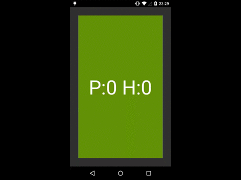

# DoubleViewPager
Horizontal + Vertical ViewPager

This example has been built with horizontal view pager which has vertical view pager on each child.
Then, you can swype in X and Y.

You can see an example on <a href="https://github.com/juliome10/DoubleViewPagerSample">DoubleViewPagerSample</a>. Or if you prefer, you can download it from play store.

## Example of use.

