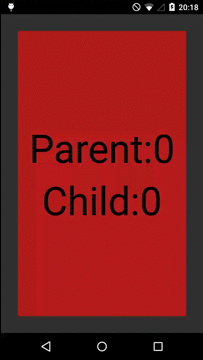

# DoubleViewPager
[](https://android-arsenal.com/details/1/1863)

Horizontal + Vertical ViewPager

## How it works
This library has been built with horizontal view pager which has vertical view pager on each child.
When the user triggers events on each child, they pass it to the parent. Then, if the event is vertical, the child processes it, otherwise, if the event is horizontal, the parent processes it.

Then, you can swype in X and Y.


## Including in your project
You can download it and add it at your project as library.

If you use gradle, you can easily include the library by specifying it as a dependency.
```
repositories {
    jcenter()
}

dependencies {
    compile 'com.github.juliome10:DoubleViewPager:1.0.1@aar'
}
```

## Samples.
You can see a sample project for Eclipse ADT on <a href="https://github.com/juliome10/DoubleViewPagerSample">Eclipse Sample</a>

There's another sample project for Android Studio on <a href="https://github.com/juliome10/DoubleViewPager/DoubleViewPagerSapmle">Android Studio Sample</a>

You can test it downloading a sample app on play store.
<a href="https://play.google.com/store/apps/details?id=com.emoiluj.doubleviewpagersample">
  
</a>

## Screenshots

